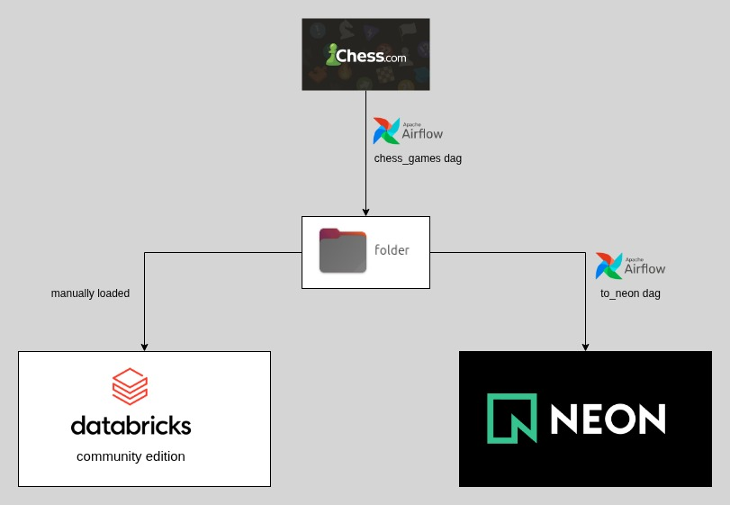

# Introduction
Welcome to my chess data portfolio project!
Here, I’ll extract, load, and transform data from my Chess.com games to showcase my skills in data engineering.
As a portfolio piece, I’ll build pipelines using free tools like Apache Airflow, Databricks Community Edition (with its limitations), and dbt.   
The goal isn’t to create an optimized, production-ready pipeline—it’s to demonstrate my code, thought process, and problem-solving approach.  
I’ll also replicate the same transformations in both Databricks and dbt to highlight my versatility with these tools.  

# Current State
1. Extract games data from chess.com API  
2. Save the extracted games to a local folder for manual import into Databricks Community Edition.  
3. Load the games from the local folder into a Neon database using the to_neon Airflow DAG.

# Next Steps
databrick architecture and transformation   
dbt transformation  
BI  

# Airflow
Note: The variables.json file should be used to import variables into the Airflow UI.      
Avoid hardcoding them.    

# chess.com API routes
## player stats
https://api.chess.com/pub/player/{username}

## games archives list
https://api.chess.com/pub/player/{username}/games/archives'

## Month archive
"https://api.chess.com/pub/player/{username}/games/yyyy/mm"